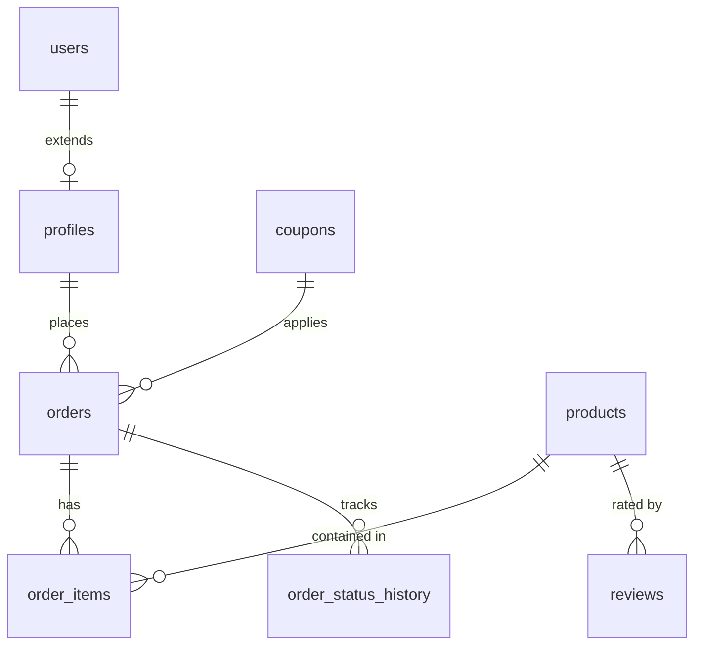

# 🌸 Bloom & Charm — Supabase Database Architecture

Welcome to the backend architecture guide for **Bloom & Charm** (Toujours Knot). Our database is powered by **Supabase (PostgreSQL)**, incorporating strict security, real-time trigger pipelines, and role-based access control.

---

## 📂 Supabase Directory Structure

All SQL setup scripts, emergency patches, and schema migrations are organized within the `supabase/migrations/` directory:

```bash
supabase/
├── README.md               # This architecture documentation
└── migrations/
    ├── 01_supabase_full_setup.sql       # Baseline table creations, RLS, seeds
    ├── 02_supabase_schema.sql           # Complete schema snapshot
    ├── 03_supabase_reviews_setup.sql    # Product reviews table and approval policy
    ├── 04_support_messages_schema.sql   # Real-time chat & support messages table
    ├── 05_supabase_emergency_fix.sql    # Policies and emergency schema corrections
    ├── 06_supabase_admin_fix.sql        # High-privilege admin bypasses and handlers
    ├── 07_supabase_final_admin_fix.sql  # Secure, non-recursive `is_admin()` checks
    ├── 08_supabase_verify_admin.sql     # Admin verification scripts
    └── 09_database_fix_v2.sql           # Additional schemas and general database fixes
```

---

## 📊 Database Schema Overview



### 🔑 Table Reference

| Table Name | Description | Key Fields | RLS Status |
| :--- | :--- | :--- | :--- |
| **`products`** | Contains catalog items (Bouquets, Keychains, Bags, Custom) | `id`, `name`, `price`, `cod`, `category` | **Enabled** (Public Read, Admin Write) |
| **`profiles`** | Extended user profiles linked to Supabase Auth | `id` (UUID), `first_name`, `email`, `role`, `points` | **Enabled** (User/Admin access only) |
| **`orders`** | Order placement details and payment transactions | `id` (string), `user_id`, `final_amount`, `status`, `payment_method` | **Enabled** (User view own, Admin view all) |
| **`order_items`** | Line items for every purchase order | `id`, `order_id`, `product_name`, `quantity`, `price` | **Enabled** (Own orders only) |
| **`reviews`** | Product reviews with an moderation approval flow | `id`, `product_id`, `rating`, `body`, `approved` | **Enabled** (Public approved, User write) |
| **`coupons`** | Promotional codes with min order values and fixed/percent types | `id`, `code`, `discount_value`, `is_active` | **Enabled** (Public read) |
| **`custom_options`**| Individual items/papers for the bouquet builder tool | `id`, `type` (flower/filler/paper), `name`, `price` | **Enabled** (Public select) |
| **`support_messages`**| Real-time messaging between user and live chat support | `id`, `session_id`, `sender_type` (user/admin), `content` | **Enabled** (Strict message channels) |
| **`order_status_history`**| Audit timeline for order processing stages | `id`, `order_id`, `status` (Processing -> Shipped -> etc) | **Enabled** (Own order history) |

---

## 🔒 Security Design (Row Level Security)

Every table has Row Level Security (RLS) enabled. RLS rules protect sensitive customer data and order details.

### 🛡️ Preventing Circular Recursion with `SECURITY DEFINER`
A standard problem in Supabase profiles is trying to run policy checks (like `is_admin()`) against the `profiles` table, which triggers a recursive lookup. 
To solve this cleanly, our function `public.is_admin()` uses the **`SECURITY DEFINER`** property:

```sql
CREATE OR REPLACE FUNCTION public.is_admin()
RETURNS BOOLEAN AS $$
  SELECT EXISTS (
    SELECT 1 FROM public.profiles
    WHERE id = auth.uid() AND role = 'admin'
  );
$$ LANGUAGE sql SECURITY DEFINER STABLE;
```
This runs with the privileges of the creator (bypassing RLS safely) rather than the executing user, completely eliminating circular loop exceptions.

---

## ⚡ Active Database Triggers & Functions

### 1. `handle_new_user()` Trigger
Fired automatically after a new record enters Supabase `auth.users` (via Auth API). It populates the public `profiles` table to maintain structured profile references:

```sql
CREATE TRIGGER on_auth_user_created
  AFTER INSERT ON auth.users
  FOR EACH ROW EXECUTE FUNCTION public.handle_new_user();
```

### 2. `increment_coupon_usage()`
Safely increments a coupon's `used_count` during successful checkout placement.

---

## 🚀 How to Apply Migrations

### 💎 Option A: Supabase SQL Editor (Recommended)
1. Log into your **Supabase Dashboard**.
2. Click **SQL Editor** from the left panel.
3. Paste the contents of `supabase/migrations/01_supabase_full_setup.sql`.
4. Click **Run**.
5. Repeat for specific updates like `03_supabase_reviews_setup.sql` or `04_support_messages_schema.sql` if they aren't pre-configured.

### 💻 Option B: Supabase CLI (Local Development)
If you run a local Supabase stack:
```bash
supabase migration up
```

---

> [!NOTE]
> All custom products (e.g., bouquets built via the interactive bouquet builder tool), customized categories, and bag orders are automatically flagged as **prepaid only** via our checkout system (`isCODAllowed`), matching the database seed specifications.
